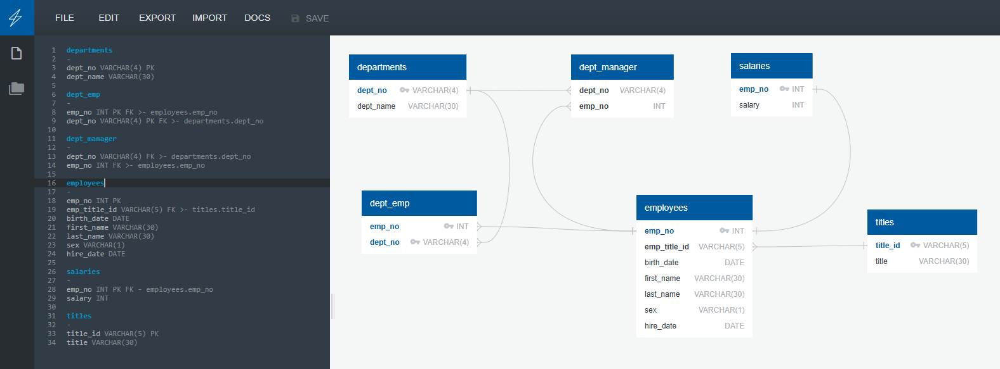

# Pewlett Hackard Employee Data Analysis

## Table of Contents
- [Project Overview](#project-overview)
- [Entity Relationship Diagram](#entity-relationship-diagram)
- [Data Modeling](#data-modeling)
- [Data Engineering](#data-engineering)
- [Data Analysis](#data-analysis)
  - [Employee List with Salaries](#employee-list-with-salaries)
  - [Employees Hired in 1986](#employees-hired-in-1986)
  - [Department Managers](#department-managers)
  - [Employees by Department](#employees-by-department)
  - [Hercules Employees](#hercules-employees)
  - [Sales Department Employees](#sales-department-employees)
  - [Sales and Development Employees](#sales-and-development-employees)
  - [Employee Last Name Frequency](#employee-last-name-frequency)
- [Conclusion](#conclusion)
- [References](#references)

---

## Project Overview
Pewlett Hackard, a fictional company, tasked us with analyzing their historical employee database from the 1980s and 1990s. The goal was to restore the database from CSV files, design an appropriate relational schema, import the data, and answer key business questions related to employees, departments, and salaries.

This project is divided into three parts:
1. **Data Modeling** - Designing a database schema based on CSV file structure.
2. **Data Engineering** - Creating database tables and importing the data.
3. **Data Analysis** - Writing SQL queries to extract meaningful insights.

---

## Entity Relationship Diagram
Below is the Entity Relationship Diagram (ERD) that represents the database structure:



This ERD displays the relationships between employees, departments, salaries, and titles, with appropriate primary and foreign keys.

---

## Data Modeling
We analyzed the six provided CSV files to create the following database schema:
- **departments**: Stores department IDs and names.
- **dept_emp**: Links employees to departments.
- **dept_manager**: Stores department managers.
- **employees**: Contains employee personal data.
- **salaries**: Tracks employee salaries.
- **titles**: Stores job titles of employees.

Refer to `table_schema.sql` for the complete schema definition.

---

## Data Engineering
The following steps were followed to engineer the database:
1. **Creating Tables**: The schema was defined with appropriate data types, primary keys, and foreign keys.
2. **Importing Data**: Data from the CSV files were loaded into the respective tables.

Refer to `departments.csv`, `dept_emp.csv`, `dept_manager.csv`, `employees.csv`, `salaries.csv`, and `titles.csv` for the raw data files used in the project.

---

## Data Analysis
### Employee List with Salaries
Query:
```sql
SELECT emp_no, last_name, first_name, sex, salary
FROM employees
JOIN salaries ON employees.emp_no = salaries.emp_no;
```

### Employees Hired in 1986
Query:
```sql
SELECT first_name, last_name, hire_date
FROM employees
WHERE EXTRACT(YEAR FROM hire_date) = 1986;
```

### Department Managers
Query:
```sql
SELECT dm.dept_no, d.dept_name, dm.emp_no, e.last_name, e.first_name
FROM dept_manager dm
JOIN employees e ON dm.emp_no = e.emp_no
JOIN departments d ON dm.dept_no = d.dept_no;
```

### Employees by Department
Query:
```sql
SELECT de.dept_no, d.dept_name, e.emp_no, e.last_name, e.first_name
FROM dept_emp de
JOIN employees e ON de.emp_no = e.emp_no
JOIN departments d ON de.dept_no = d.dept_no;
```

### Hercules Employees
Query:
```sql
SELECT first_name, last_name, sex
FROM employees
WHERE first_name = 'Hercules' AND last_name LIKE 'B%';
```

### Sales Department Employees
Query:
```sql
SELECT e.emp_no, e.last_name, e.first_name
FROM employees e
JOIN dept_emp de ON e.emp_no = de.emp_no
JOIN departments d ON de.dept_no = d.dept_no
WHERE d.dept_name = 'Sales';
```

### Sales and Development Employees
Query:
```sql
SELECT e.emp_no, e.last_name, e.first_name, d.dept_name
FROM employees e
JOIN dept_emp de ON e.emp_no = de.emp_no
JOIN departments d ON de.dept_no = d.dept_no
WHERE d.dept_name IN ('Sales', 'Development');
```

### Employee Last Name Frequency
Query:
```sql
SELECT last_name, COUNT(*) AS name_count
FROM employees
GROUP BY last_name
ORDER BY name_count DESC;
```

---

## Conclusion
This project successfully reconstructed the Pewlett Hackard employee database and provided meaningful insights through SQL queries. The data analysis helped in understanding employee distributions, department structures, and salary information.

---

## References
- SQL Queries were written based on the project scope.
- Entity Relationship Diagram was created using QuickDBD.
- Data imported from provided CSV files.
- ChatGPT was used as a resource for structuring the README file.